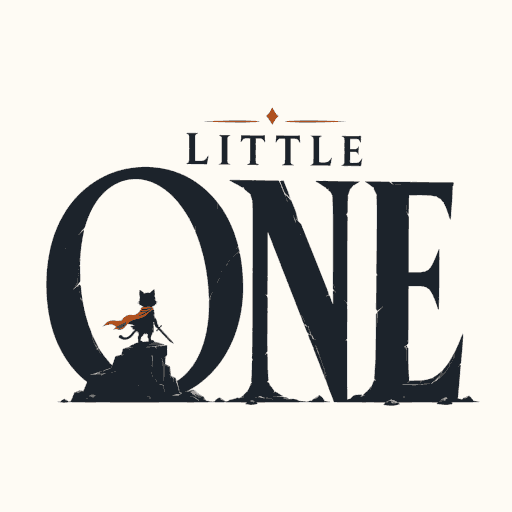

# Little One

<p></p>

```text
The world is dangerous.
You are small.
You are the .wwarrior.
The Little One.
```

A tiny Android game written in native C.

Current goal:

- Learn Android NativeActivity
- Build a playable game with minimal dependencies
- Keep APK size as small as possible
- Have fun

## Project Status

Early prototype.

Current APK size:

```text
~100 KB
```

The application launches on a real Android device and is built entirely from native C code.

## Philosophy

Modern mobile games often measure their size in hundreds of megabytes.

Little One explores the opposite direction:

> How much game can fit into a few kilobytes?

The project takes inspiration from old demoscene productions such as `.kkrieger`, while focusing on creating an actual playable game rather than a technical showcase.

## Planned Gameplay

A minimal endless runner.

Controls:

- Left — move left
- Right — move right
- Jump
- Jump in air — SMASH

The design is heavily inspired by the core mechanics of Smash!ng Cats.

## Tech Stack

- C
- Android NativeActivity
- Android NDK
- CMake
- Gradle

No game engine.

No SDL.

No Unity.

No Unreal.

## Building

```bash
./build.sh
```

The build menu allows:

- Build
- Install
- Launch
- View logs
- Uninstall
- APK size inspection

## Structure

```text
src/
    main.c
    config.h

app/
    Android wrapper
    resources
    manifest
```

The long-term plan is to separate the project into:

```text
src/
    game/
    renderer/
    input/
    platform/
    core/
```

## Asset Pipeline

Little One uses procedural assets instead of traditional PNG, WAV or OGG files.

Tools:

- [Cat Meow Studio](https://cms.catemup.com)

## License

Not decided yet.

## Why?

Because making a game smaller than its own splash screen sounds funny.
